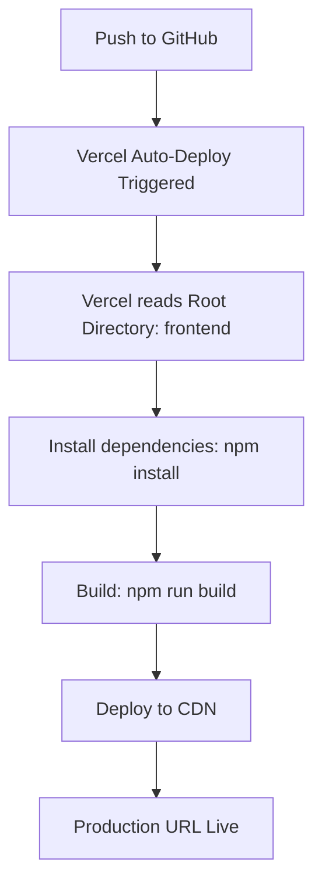

# Vercel 404 Fix Guide - Monorepo Next.js Deployment

## 🔍 ROOT CAUSE

**Issue:** Vercel deployment succeeds but shows `404: NOT_FOUND` on production URL

**Cause:** Incorrect Root Directory configuration in Vercel. Vercel is looking at the repository root (`/`) instead of the `frontend` folder where your Next.js app lives.

---

## ✅ STEP-BY-STEP FIX

### Step 1: Access Vercel Project Settings

1. Go to https://vercel.com/dashboard
2. Select your project from the list
3. Click **Settings** tab at the top

### Step 2: Configure Root Directory

1. In Settings, click **General** in the left sidebar
2. Scroll down to **Root Directory** section
3. Click **Edit** button
4. Enter: `frontend`
5. Check the box: ☑️ **Include source files outside of the Root Directory in the Build Step**
6. Click **Save**

### Step 3: Configure Build Settings

1. Still in Settings, scroll to **Build & Development Settings**
2. Verify these settings:

   **Framework Preset:** `Next.js`

   **Build Command:** `npm run build` (or leave empty for auto-detect)

   **Output Directory:** `.next` (or leave empty for auto-detect)

   **Install Command:** `npm install` (or leave empty for auto-detect)

3. Click **Save** if you made any changes

### Step 4: Configure Environment Variables (if needed)

1. In Settings, click **Environment Variables** in left sidebar
2. Add any required variables:
   ```
   NEXT_PUBLIC_API_URL=https://your-backend-url.com
   ```
3. Select environment: **Production**, **Preview**, **Development**
4. Click **Save**

### Step 5: Trigger Redeploy

**Option A: Redeploy from Dashboard**
1. Go to **Deployments** tab
2. Click on the latest deployment
3. Click **⋯** (three dots) menu
4. Click **Redeploy**
5. Uncheck "Use existing Build Cache" ✅
6. Click **Redeploy**

**Option B: Push to Trigger Auto-Deploy**
```bash
# Already done - your latest push will trigger deployment
git log --oneline -1
# Should show: "fix: correct Next.js App Router folder structure..."
```

---

## 🧪 VERIFICATION STEPS

### 1. Monitor Build Logs

1. Go to **Deployments** tab
2. Click on the running deployment
3. Watch the build logs
4. Look for:
   ```
   ✓ Compiled successfully
   Route (app)
   ├ ○ /
   ├ ○ /analytics
   ├ ○ /completed
   ├ ○ /dashboard
   ├ ○ /settings
   ├ ○ /signin
   ├ ○ /signup
   └ ○ /tasks
   ```

### 2. Test Production URLs

Once deployed, test these URLs (replace `your-project` with your actual Vercel project name):

```bash
# Landing page
https://your-project.vercel.app/

# Auth pages
https://your-project.vercel.app/signin
https://your-project.vercel.app/signup

# Dashboard pages
https://your-project.vercel.app/dashboard
https://your-project.vercel.app/tasks
https://your-project.vercel.app/completed
https://your-project.vercel.app/analytics
https://your-project.vercel.app/settings
```

### 3. Check for Errors

- Open browser DevTools (F12)
- Check Console tab for errors
- Check Network tab for failed requests
- Verify all routes return 200 status

---

## 📋 QUICK REDEPLOY CHECKLIST

- [x] Folder structure fixed (app/app → app/(dashboard))
- [x] Navigation paths updated (/app/* → /*)
- [x] Changes committed and pushed to GitHub
- [ ] Vercel Root Directory set to `frontend`
- [ ] Build settings verified (Framework: Next.js)
- [ ] Environment variables configured (if needed)
- [ ] Redeployed with cache cleared
- [ ] Production URLs tested and working
- [ ] No 404 errors
- [ ] All navigation links work

---

## 🔧 TROUBLESHOOTING

### Issue: Still getting 404 after setting Root Directory

**Solution:**
1. Clear Vercel build cache
2. Go to Deployments → Latest → ⋯ → Redeploy
3. Uncheck "Use existing Build Cache"
4. Redeploy

### Issue: Build succeeds but pages show blank

**Solution:**
1. Check browser console for JavaScript errors
2. Verify environment variables are set correctly
3. Check if API_URL is accessible from production

### Issue: Some routes work, others show 404

**Solution:**
1. Verify all pages exist in `app/(dashboard)/` folder
2. Check file names are lowercase: `page.tsx` not `Page.tsx`
3. Ensure each route has a `page.tsx` file

### Issue: CSS/styles not loading

**Solution:**
1. Check `globals.css` is in `app/` directory
2. Verify `layout.tsx` imports globals.css
3. Clear browser cache and hard refresh (Ctrl+Shift+R)

### Issue: "Module not found" errors in build

**Solution:**
1. Check all import paths use `@/` alias correctly
2. Verify `tsconfig.json` has correct path mappings
3. Ensure all dependencies are in `package.json`

---

## 📊 EXPECTED RESULTS

### Before Fix:
```
URL: https://your-project.vercel.app/
Result: 404: NOT_FOUND
```

### After Fix:
```
URL: https://your-project.vercel.app/
Result: ✅ Landing page loads

URL: https://your-project.vercel.app/dashboard
Result: ✅ Dashboard page loads (after login)

URL: https://your-project.vercel.app/tasks
Result: ✅ Tasks page loads
```

---

## 🎯 VERCEL CONFIGURATION SUMMARY

**Correct Settings for Monorepo:**

```
Project Settings:
├── Root Directory: frontend
├── Framework Preset: Next.js
├── Build Command: npm run build (auto)
├── Output Directory: .next (auto)
├── Install Command: npm install (auto)
└── Node Version: 18.x or 20.x (auto)

Environment Variables:
└── NEXT_PUBLIC_API_URL: https://your-backend.com (if needed)
```

---

## 🚀 DEPLOYMENT WORKFLOW



---

## 📚 ADDITIONAL RESOURCES

- **Vercel Monorepo Guide:** https://vercel.com/docs/monorepos
- **Next.js Deployment:** https://nextjs.org/docs/deployment
- **Vercel Root Directory:** https://vercel.com/docs/projects/project-configuration#root-directory

---

## ✨ SUCCESS CRITERIA

Your deployment is successful when:

- ✅ Build completes without errors
- ✅ Routes show correct paths (no `/app` prefix)
- ✅ Landing page loads at root URL
- ✅ All dashboard pages accessible
- ✅ Navigation works correctly
- ✅ No 404 errors
- ✅ No console errors
- ✅ Authentication flow works

---

## 🆘 STILL HAVING ISSUES?

If you're still seeing 404 errors after following all steps:

1. **Check Vercel Logs:**
   - Go to Deployments → Latest → Function Logs
   - Look for error messages

2. **Verify Git Push:**
   ```bash
   git log --oneline -1
   # Should show latest commit with folder structure fix
   ```

3. **Check Vercel Dashboard:**
   - Ensure deployment status is "Ready"
   - Check deployment URL matches your domain

4. **Test Locally:**
   ```bash
   cd frontend
   npm run build
   npm start
   # Visit http://localhost:3000
   ```

5. **Contact Support:**
   - Vercel Support: https://vercel.com/support
   - Provide deployment URL and error logs

---

**Status:** ✅ Code fixed and pushed | ⏳ Vercel configuration pending

**Next Action:** Configure Vercel Root Directory to `frontend` and redeploy
